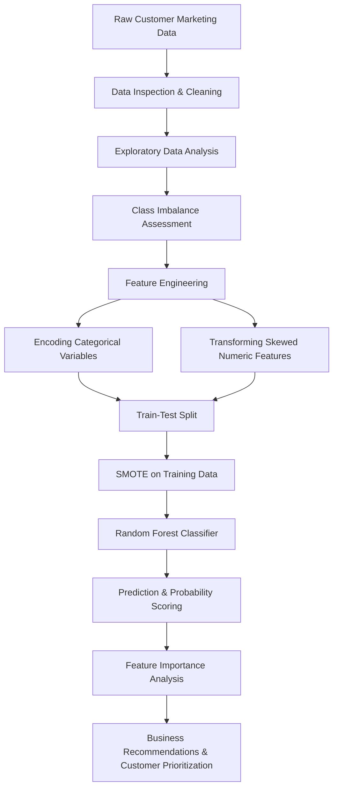

# Term Deposit Marketing Prediction

## Overview

This project tackles a realistic **bank marketing classification problem**: predicting whether a customer will subscribe to a **term deposit** based on demographic, financial, and campaign-related attributes.

The project goes beyond simple model training. It also focuses on:

-   understanding the business problem through exploratory analysis,
-   handling a **highly imbalanced target**,
-   identifying the **customers most likely to respond positively**, and
-   extracting **feature-level insights** to guide future marketing strategy.

This makes the repository a strong example of applied machine learning for **customer analytics, propensity modeling, and business decision support**.

---

## Business Objective

Banks often run large-scale outreach campaigns, but only a small portion of customers actually subscribe to a term deposit. A predictive model can help prioritize outreach by answering three practical questions:

1.  **Who is most likely to subscribe?**
2.  **Which customer segments should be targeted first?**
3.  **Which variables matter most in driving customer conversion?**

The goal of this project is to build a classification workflow that helps answer all three.

---

## Problem Statement

Given customer and campaign data, predict whether the target variable `y` is:

-   `yes` → customer subscribes to a term deposit
-   `no` → customer does not subscribe

This is a **binary classification problem** with a **strong class imbalance**, making the task closer to a real-world marketing analytics use case than a toy ML example.

---

## Dataset Snapshot

The project notebook works with a dataset containing:

-   **40,000 customer records**
-   **14 columns**
-   a mix of:
    -   numeric variables
    -   categorical variables
    -   binary-like categorical indicators

Features used in the analysis:

-   `age`
-   `job`
-   `marital`
-   `education`
-   `default`
-   `balance`
-   `housing`
-   `loan`
-   `contact`
-   `day`
-   `month`
-   `duration`
-   `campaign`

Target:

-   `y` → term deposit subscription outcome

---

## Key Technical Highlights

-   Performed structured **exploratory data analysis (EDA)**
-   Investigated class imbalance in the target variable
-   Applied feature preprocessing to improve model readiness
-   Used **one-hot encoding** for categorical variables
-   Used **Quantile Transformation** / feature transformation for skewed inputs
-   Addressed imbalance using **SMOTE**
-   Trained a **Random Forest Classifier**
-   Ranked features using **model-derived feature importance**
-   Generated **response probabilities** to identify likely positive responders

---

## Project Workflow



---

## Step-by-Step Project Flow

### 1. Business Framing

The project begins with a practical business framing of the term deposit marketing problem. Instead of focusing only on model accuracy, the workflow is designed to support customer prioritization and campaign decision-making.

### 2. Data Understanding

The notebook inspects structure, data types, and distributions across both numeric and categorical variables. This step establishes the shape of the problem and identifies what kind of preprocessing will be required.

### 3. Exploratory Data Analysis

EDA is used to understand:

-   the spread of customer demographics,
-   account balance behavior,
-   communication channels,
-   seasonal trends across months,
-   and the distribution of the target variable.

This stage helps connect the data to business intuition and reveals early signals that may influence customer response.

### 4. Class Imbalance Diagnosis

A major challenge in this dataset is that positive responses are much rarer than negative ones. This means a naive model could appear strong on accuracy while still performing poorly on the customers the business actually cares about.

### 5. Feature Preparation

The project prepares features for modeling by:

-   separating predictors from the target,
-   encoding categorical variables,
-   and transforming skewed numeric variables.

This is a critical step because real-world customer data is typically heterogeneous and not immediately model-ready.

### 6. Train/Test Strategy

The dataset is split into training and test sets using a stratified approach so that the target distribution remains consistent across both sets.

### 7. Imbalance Handling with SMOTE

To better learn the minority class, the training data is rebalanced using **SMOTE (Synthetic Minority Over-sampling Technique)**. This improves the model’s ability to detect likely subscribers instead of defaulting toward the majority class.

### 8. Model Training

A **Random Forest Classifier** is trained on the resampled data. This model is well suited here because it handles nonlinear relationships, mixed feature types, and interactions between customer attributes.

### 9. Probability-Based Customer Ranking

Rather than stopping at class predictions alone, the workflow computes **response probabilities**. This makes the output more useful for business teams because customers can be ranked by likelihood of subscription.

### 10. Feature Importance & Interpretation

The final stage extracts feature importance values from the trained model, helping explain which variables most influence the prediction outcome.

---

## What the Analysis Suggests

Based on the notebook’s exploratory and modeling outputs, several practical patterns emerge:

-   **Call duration** appears to be the strongest predictive signal.
-   **Balance**, **age**, and **day of contact** also contribute meaningfully.
-   Communication-related variables such as **contact channel** and **month** matter.
-   The workflow identifies customers with the **highest predicted response probabilities**, which can support campaign prioritization.

These findings make the project valuable not just as a machine learning exercise, but as a **business analytics artifact**.

---

## Top Features Identified

Among the most important variables surfaced by the model are:

-   `duration_log`
-   `balance_qt`
-   `age`
-   `day`
-   `housing_yes`
-   month-related indicators such as `month_aug`, `month_jul`, `month_nov`, `month_may`
-   customer profile variables such as marital status, loan status, and job category

This reinforces an important lesson in applied ML: **customer response is often shaped by a combination of behavioral, financial, and campaign-timing signals** rather than a single attribute.

---

## Repository Structure

```text
.
├── Term_deposit_prediction.ipynb   # Main notebook containing EDA, preprocessing, modeling, and interpretation
├── requirements.txt                # Project dependencies
├── README.md                       # Project documentation
├── .gitignore
├── .idea/
└── env_term/
```

---

## Tech Stack

-   **Python**
-   **Jupyter Notebook**
-   **NumPy**
-   **Pandas**
-   **Matplotlib**
-   **Seaborn**
-   **SciPy / Statsmodels**
-   **scikit-learn**
-   **imbalanced-learn (SMOTE)**

---

## Installation

### 1. Clone the repository

```bash
git clone https://github.com/ninad22dixit/oo5VknNhbXNxhjmR.git
cd oo5VknNhbXNxhjmR
```

### 2. Create a virtual environment

```bash
python -m venv venv
```

### 3. Activate the environment

**Windows**

```bash
venvScriptsactivate
```

**macOS / Linux**

```bash
source venv/bin/activate
```

### 4. Install dependencies

```bash
pip install -r requirements.txt
```

### 5. Launch Jupyter

```bash
jupyter notebook
```

Then open:

```bash
Term_deposit_prediction.ipynb
```

---

## Future Improvements

Potential next steps for extending this project include:

-   comparing multiple classification models,
-   hyperparameter tuning,
-   threshold optimization for recall/precision trade-offs,
-   SHAP-based explainability,
-   calibration of predicted probabilities,
-   and building a lightweight deployment app for marketing teams.

---

## Concluding Remarks

This project is a practical example of how machine learning can be applied to a real customer conversion problem. It combines technical rigor with business interpretation, showing how data science can move beyond prediction alone and contribute directly to smarter targeting decisions.

---

# Author

**Ninad Dixit**

Machine Learning | Data Science | Applied AI

GitHub: [https://github.com/ninad22dixit](https://github.com/ninad22dixit)

---